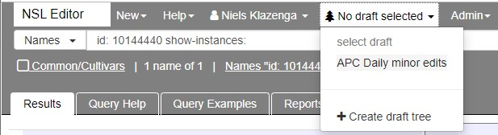
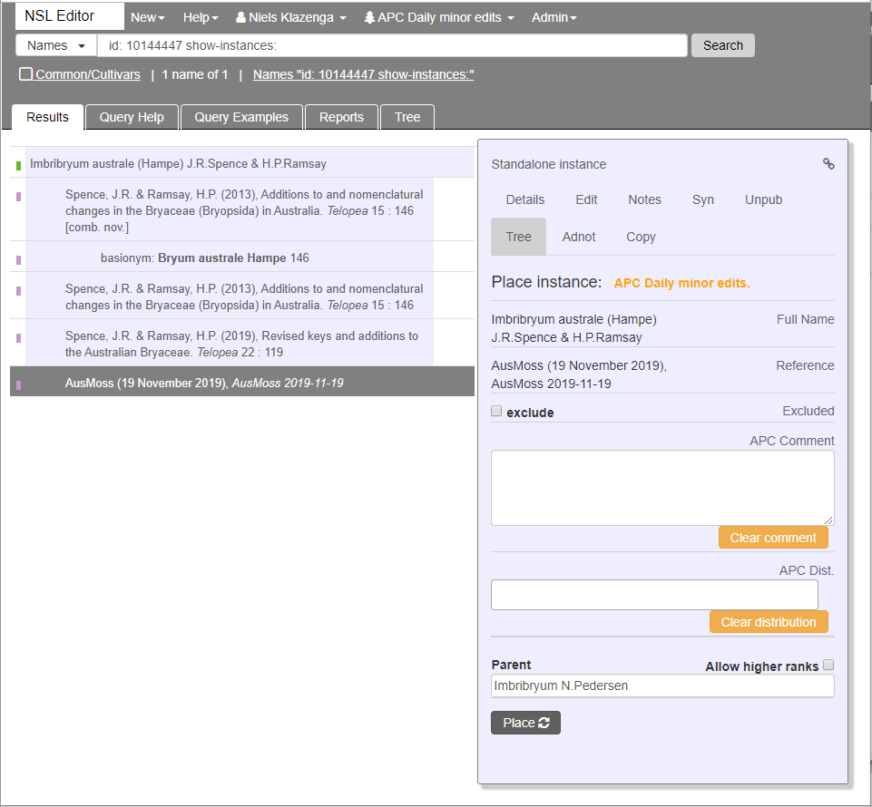

# APC tree

In order to be able to edit the APC tree we need to select a draft tree from the **select draft** drop-down in the top menu (it will actually say **No draft selected** in the menu if you haven't selected a draft tree yet).

We select the 'APC Daily minor edits' tree, which is a draft tree that is always there. When no edits have been made yet, it is an exact copy of the APC tree.

## Place an instance on the tree

To place in instance on the tree, select the instance and open the **Tree** tab.

The only information you have to fill in is the **Parent**. For instances of names of generic and lower ranks this will already be filled in. Note that for genera it is not necessarily filled in correctly.

::: warning Note
In AusMoss, we don't use the APC distribution. Instead we add the distribution as instance notes.
:::

Once you have made sure the information is correct, you can click **Place**. A message will appear at the bottom saying that the instance has been placed.

When you refresh the page, you can see that the instance now has the APC Daily minor edits tick. Once the draft tree is published this will become an APC tick.

## Remove an instance from the tree

To remove an instance from the tree, select the instance and open the **Tree** tab. The **Remove** button is all the way at the bottom.

You will be asked to **Confirm** or **Cancel**. Assuming you indeed want to remove the instance, click **Confirm remove**.

You'll get a message telling you what just happened. It is in green, so it must be okay. The waste bucket in the **Confirm remove** button will keep spinning until you click **Refresh** or refresh the page.

When you have refreshed the page, you'll see that the APC Daily minor edits tick has disappeared and only the APC tick is left. When the draft tree is published that will have gone as well.

## Publish the draft tree

In order to publish the draft tree, click on the **APC Daily minor edits** item in the top menu and then "Publish 'Daily minor edits'".

There are probably a few more steps to go through, but I am not ready to publish my draft tree yet, so I will finish this later.

