# Spence & Ramsay (2019)

## Brachymenium nepalense

*Brachymenium nepalense* is already in AusMoss and it appears Spence & Ramsay (2019) haven't made any changes to the concept:

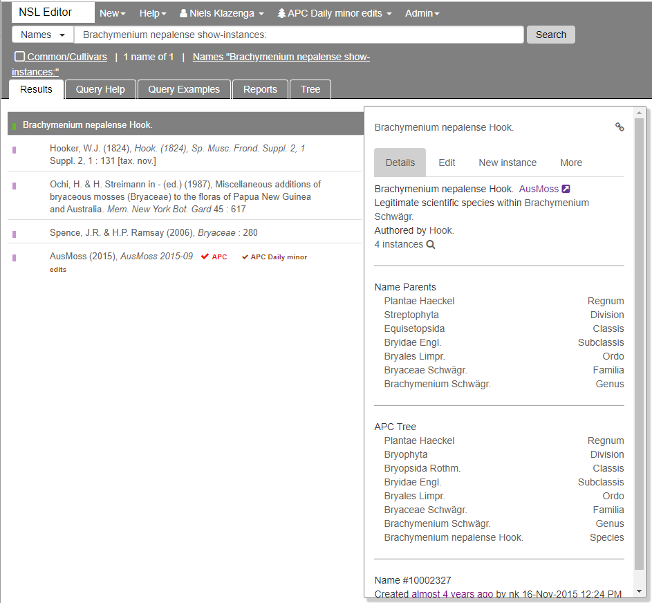

Therefore we only have to add a secondary instance:

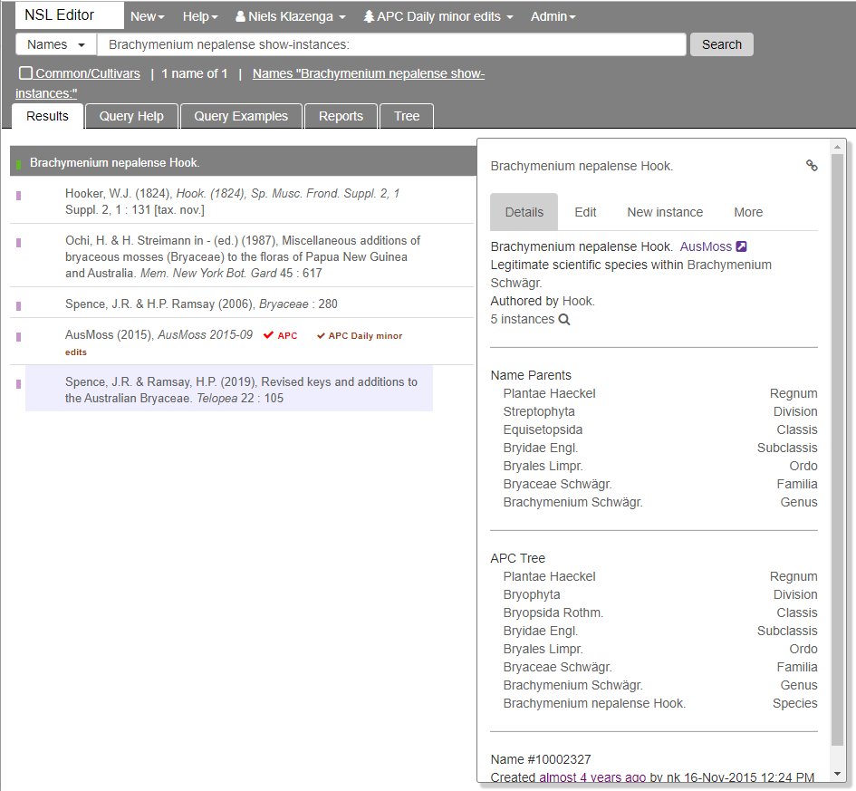

## Gemmabryum caespiticium

The combination *Gemmabryum caespiticium* is not yet in AusMoss, so we'll have to add it:

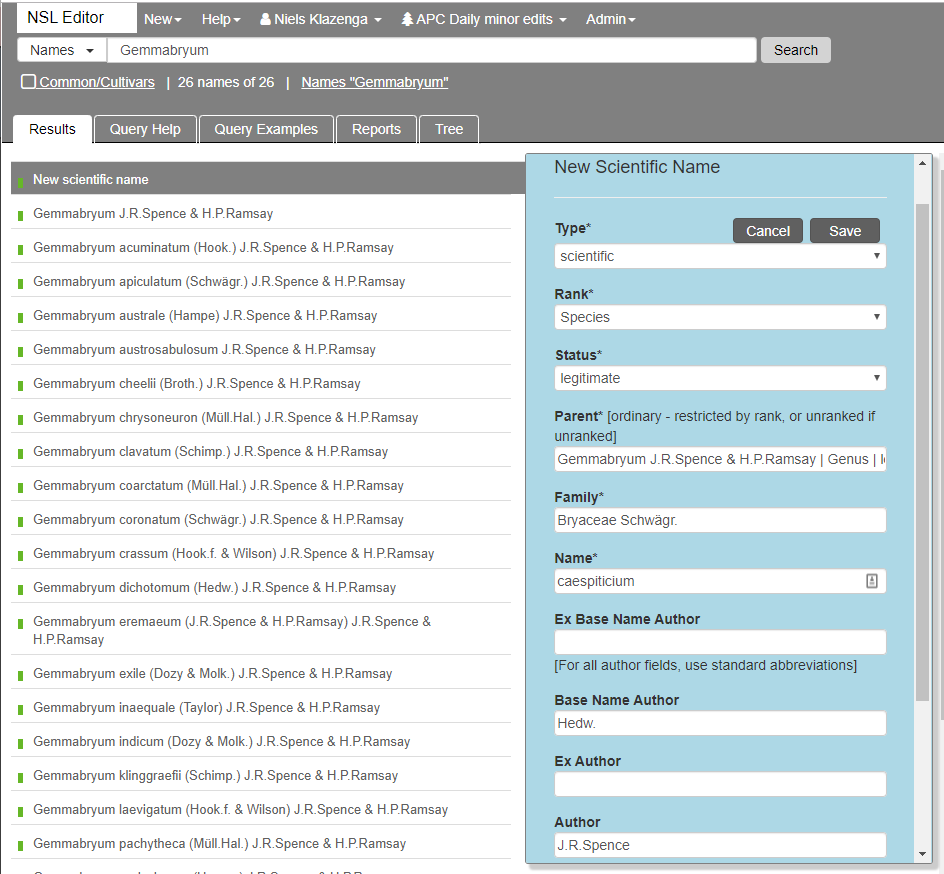

We need to add the protologue of *Gemmabryum caespiticium* as a [primary instance](/new-name/primary-instance/). You can most easily find the reference for the instance by typing the name of the first author and the year, in this case 'Spence 2009'. Select the reference, or, if it is not already there, add a [new reference](/new-reference/).

When done, hit **Create instance** and refresh the page.

Since *Gemmabryum caespiticium* was a new combination rather than a new taxon, we need to link it to its basionym. In the NSL you do that under the 'Syn' tab of the primary instance. The basionym of *Gemmabryum caespiticium*, *Bryum caespiticium*, is already in AusMoss, so we do not have to add the name as well. You can find it by starting to type the name 'Bryum caespiticium' in the **The name (and optional year)&ast; as referenced below** input and the instances will show in the drop-down. Make sure to pick the primary instance, if there is more than one.

The **Type** of this instance is 'basionym' (we only use the 'basionym' and 'replaced synonym' types for primary (or protologue) instances).

::: tip
Note that I forgot to give the page. I fixed that up later
:::

After hitting **Create instance** and refreshing the page, the page looks like this:

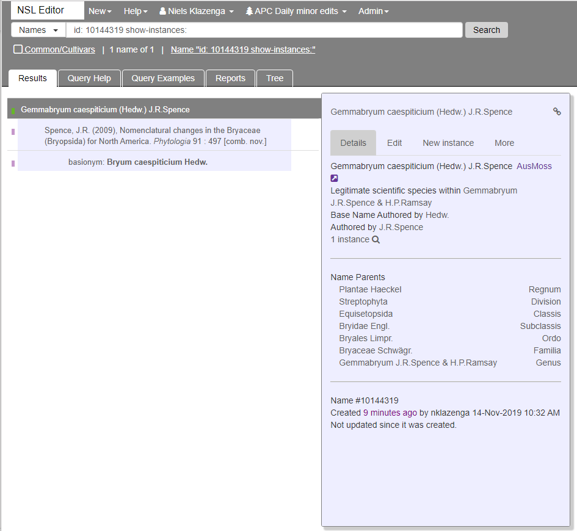

Now we add the secondary reference instance for Spence & Ramsay (2019)

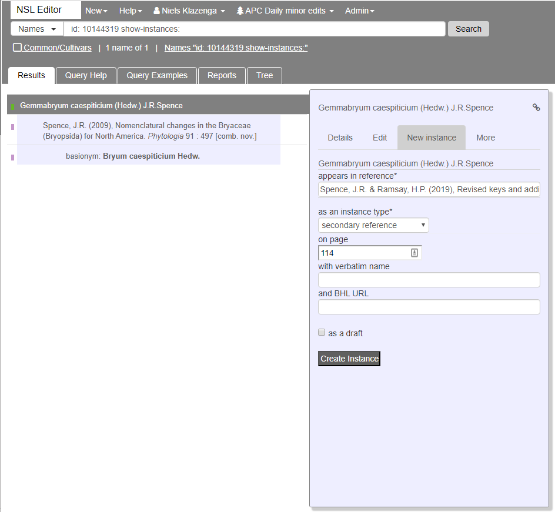

Since *Gemmabryum caespiticium* is new to AusMoss, we need to add an AusMoss instance as well.

We can also place the AusMoss instance on the APC tree. You can do that in the 'Tree' tab of the AusMoss instance. Check whether the information there is correct and hit **Place**. You'll get a message saying 'Placed Gemmabryum caespiticium (Hedw.) J.R.Spence'.

When you refresh the page, you can see that it  has the 'APC daily minor edits' tick. This indicates that it is on the draft tree. When the draft tree is published, this will be replaced by an 'APC' tick.

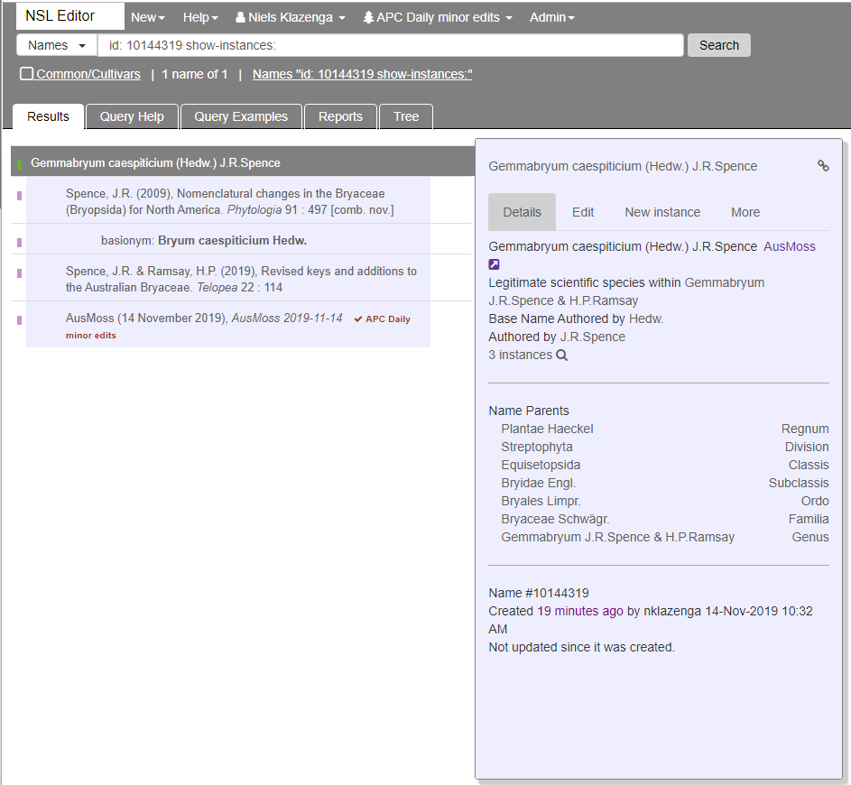

*Bryum caespiticium* was in AusMoss as a taxonomic synonym of *Ptychostomum angustifolium*.

::: warning
This is a bit of a complicated nomenclatural situation, as *Bryum caespiticium* is older and hence has priority over *Bryum angustifolium*. However, the combination *Ptychostomum caespiticium* was not available, so *Bryum angustifolium* became the basionym of the new combination, *Ptychostomum angustifolium*, and *Bryum caespiticium* a synonym.
:::

Therefore, we need to remove the AusMoss instance of *Ptychostomum angustifolium* from the APC tree. Because of the tricky relationship between *Ptychostomum angustifolium* and *Gemmabryum caespiticium* and because Spence & Ramsay (2019) did not list *Bryum angustifolium* as a synonym of *Gemmabryum caespiticium*, I initially messed this up a bit, so no screenshot, but below is the end result after I cleaned up my mess.

You can see that the AusMoss 2015 instance of *Ptychostomum angustifolium* has the 'APC' tick, but not the 'APC daily minor edits' tick. This is because it is no longer on the draft tree. Once the draft tree is published, the APC tick will disappear as well.

::: tip
Also note that I also added the synonyms from the *Flora of Australia* treatment (Spence and Ramsay, 2006); that's why they are grey. In AusMoss pre-NSL, I only used to add new synonyms.
:::

Don't forget to also add *Bryum angustifolium* (and other synonyms) as synonyms to the AusMoss instance for *Gemmabryum caespiticium*

## Gemmabryum chrysoneuron

*Gemmabryum chrysoneuron" is already in AusMoss and it appears Spence & Ramsay (2019) did not make any changes, so I just added the synonyms for the Flora of Australia treatment (Spence & Ramsay, 2006)...

... and added a secondary reference instance.

## Gemmabryum coarctatum

*Gemmabryum coartatum* is in AusMoss, Spence & Ramsay (2019) didn't change anything and the Flora of Australia treatment doesn't list taxonomic synonyms, so we only have to add a secondary reference instance.

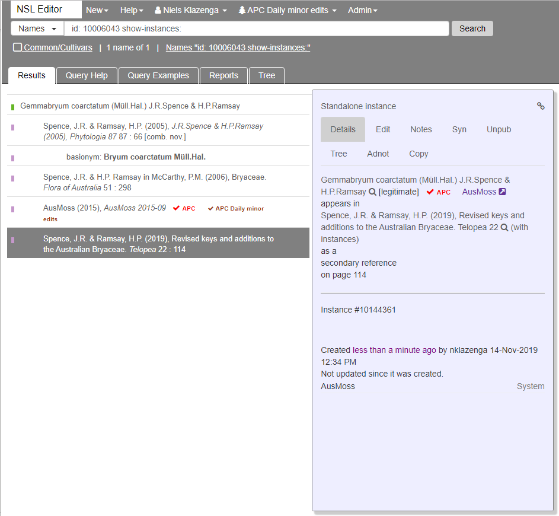

## Gemmabryum dichotomum

For *Gemmabryum dichotomum* we add the synonyms for the Flora of Australia treatment (Spence & Ramsay, 2006) and the instance for Spence & Ramsay 2019.

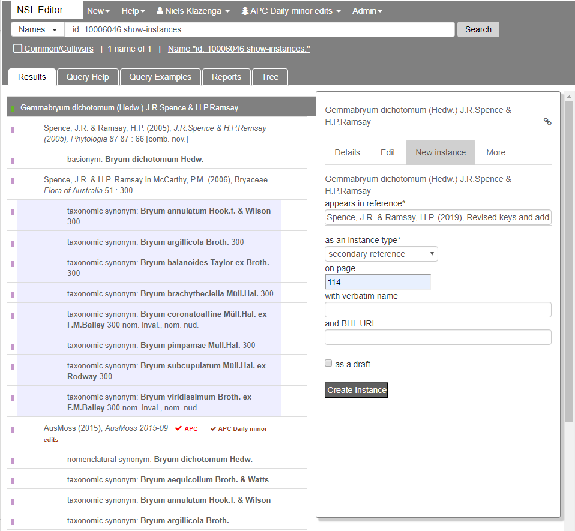

## Gemmabryum erythropilum

*Gemmabryum erythropilum* sec. Spence & Ramsay (2019) is a new record for Australia. Therefore we have to add a new name, but since *Gemmabryum erythropilum* is a combination of *Bryum erythropilum*, we add the basionym first.

Once the name has been created, we add the protologue. The protologue of *Bryum erythropilum* M.Fleisch. is 'Musci Buitenzorg 2: 533. 1904'. There are many (old) protologue citations with *Die Musci der Flora von Buitenzorg* Vol. 2 in them, but the book itself is not there, so let's add it.

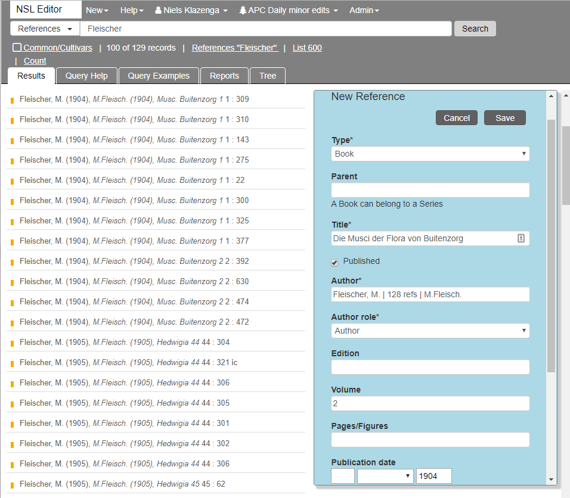

We can now create the protologue instance for *Bryum erythropilum*. You can find the reference back by typing 'Fleischer 1904' and picking the rigth one from the drop-down list. The type of instance is 'tax. nov.'.

Now we create the name record for *Gemmabryum erythropilum*.

The protologue of *Gemmabryum erythropilum* is also a reference we don't have yet, so we add it.

Now we can add the protologue of *Gemmabryum erythropilum*. This is a 'comb. nov.' instance.

Since this is a 'comb. nov.' instance, we have to add the link to the basionym we just added. You do this in the 'Syn' tab of the protologue instance.

As the protologue is also an Australian report, we add a secondary  instance for it as well.

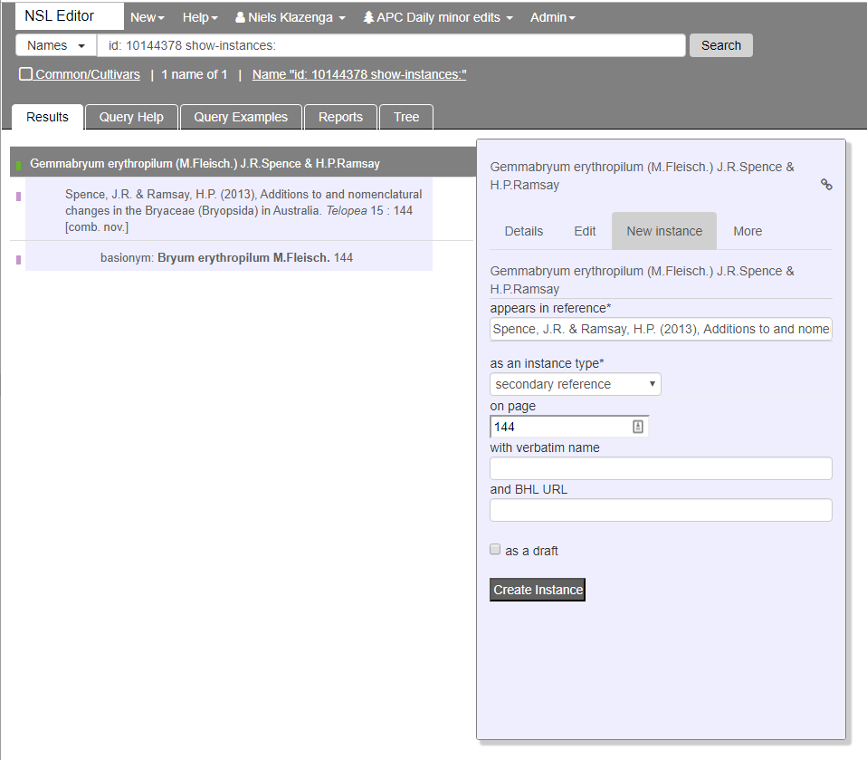

We can add a note with the distribution (only because it is given in the reference).

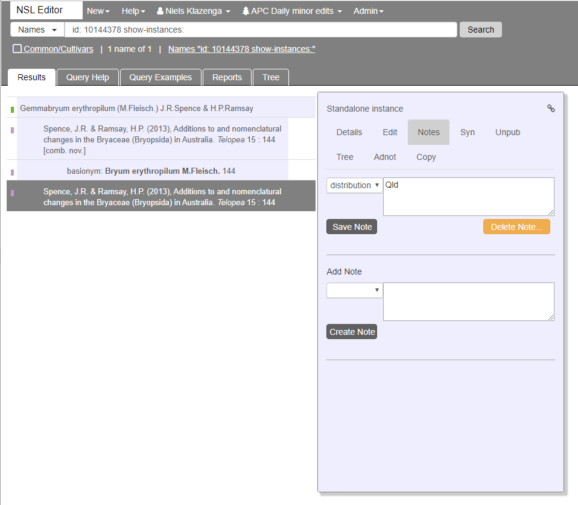

Now we add the Spence & Ramsay (2019) instance.

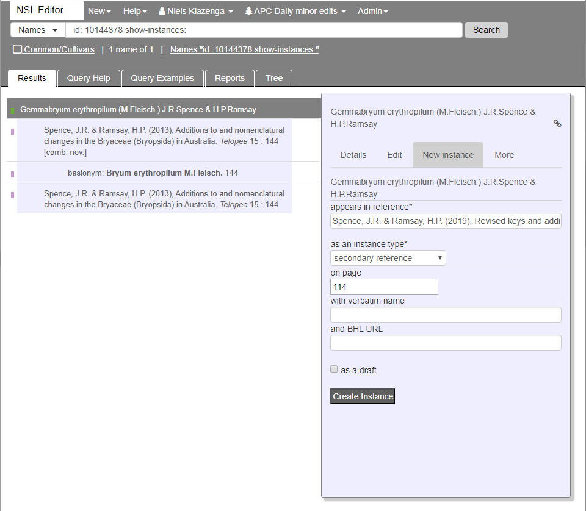

Since *Gemmabryum erythropilum* is new to AusMoss, we add an AusMoss instance as well.

Add a note for the distributtion.

Add the AusMoss instance to the APC tree.

Hit **Place**.

And here is the end result after refreshing the page (you can do that either by hitting **F5** or by clicking on the **Search** button).

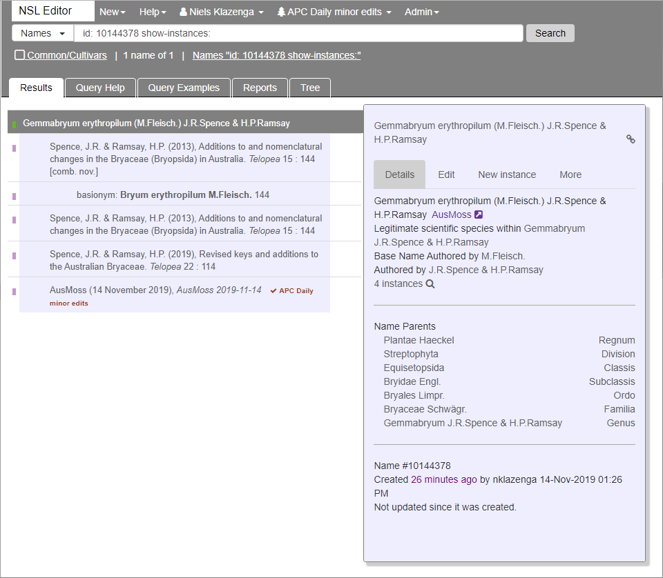