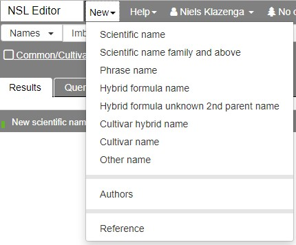

# New author

You can create a new author by clicking on **New** in the top menu and then on **Authors**

- **Name**: this is the name as you would like it to appear in the citation of a Reference.

- **Abbreviation**: This is the IPNI standard form that will appear in the authorship of the name. Authors and their standard forms may be searched in the [International Plant Names Index (IPNI)](https://ipni.org). Tropicos uses the IPNI standard forms as well, so that will mostly be the easiest way to get or check them.

  ::: tip Note
  Need to find out if IPNI authors list, or only the ones for bryophytes, have been pre-loaded. If not, we might still do that.
  :::

::: tip Note
For groups of authors, just type in the entire string, for example 'Spence, J.R. & Ramsay, H.P.' in the **Name** field and 'J.R.Spence & H.P.Ramsay' in the **Abbreviation** field.

For author strings with three or more authors, I prefer to separate the authors with semicolons, rather than commas, as it makes for easier parsing, even if it might not look as nice in the front end. For example, 'Tan, B.C.; Ramsay, H.P. & Schofield, W.B.'.
:::
