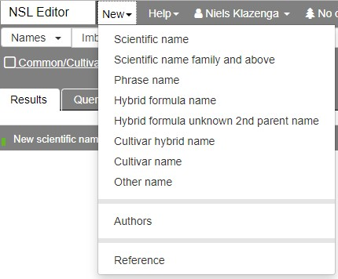
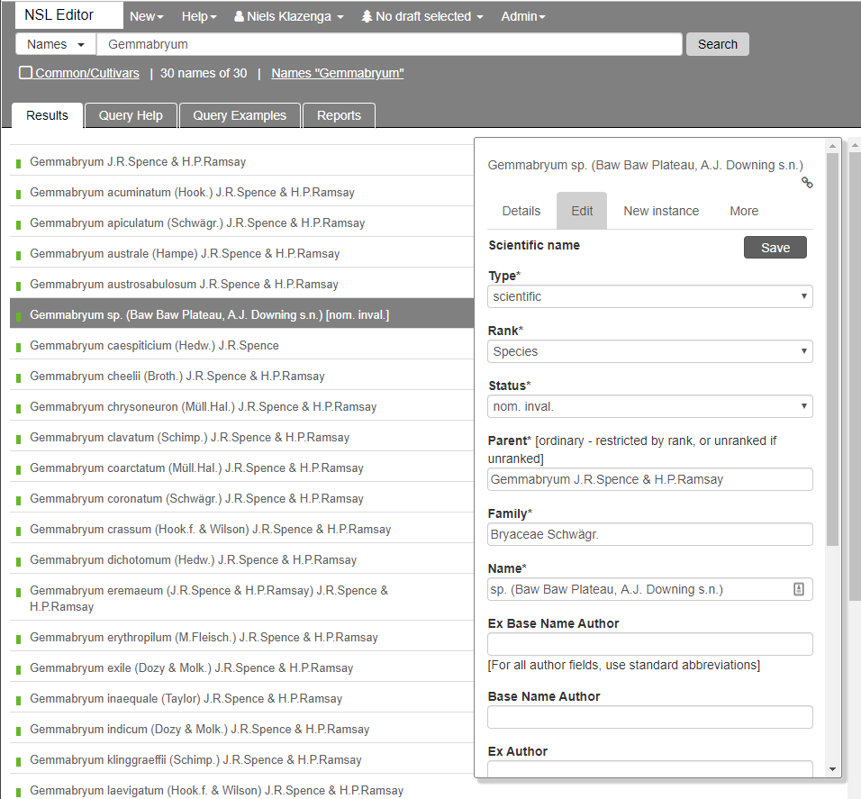
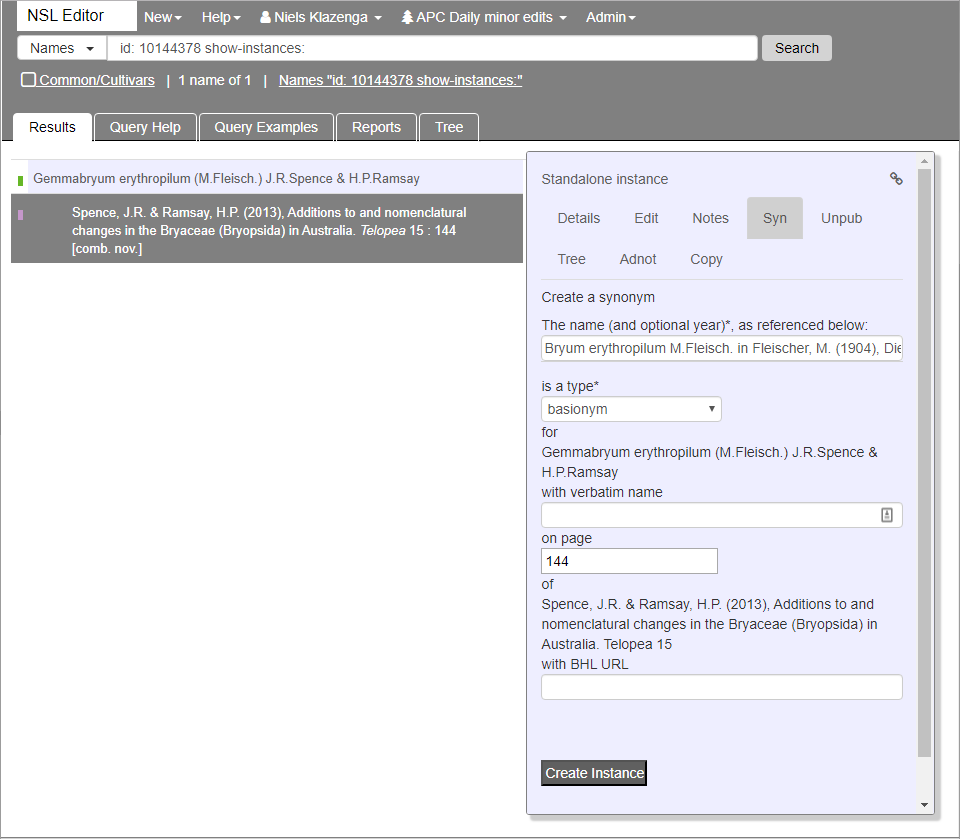

# New name

In order to create a new name record, click **New** in the top menu and then **Scientific name**. For the a name with rank of family or higher, use **New->Scientific name family and above**.

You can now enter the data in the **Name** dialogue in the righthand side of the window.

- I don't find the **Type** of name very important and have tried and failed to add an informal name using **New->Phrase name**, so I am happy to leave the value of the **Type** field as 'Scientific', even in the very rare case that the name is not a "scientific name".

  

  In the highly unlikely case that you encounter a hybrid name or hybrid formula though, you should select those from the **Type** pick list, as the value of this field might affect the format of the name string.

- If the rank of the new name is something other than species, select the correct value from the **Rank** pick list.

- Select the nomenclatural status from the **Status** pick list. In AusMoss we will probably only use a small part of the options provided. I use 'nom. inval.' for informal or phrase names (as that's what they are).

- The **Parent** field is required for names of rank lower than family. If you have opened the **New Name** form with **New->Scientific name family or below**, **Parent** is not required. You need to have added the record for the parent already, so you can select it from the drop-down that appear once you start typing the name. If the name is not there yet, you need to create it before continuing.

- Because APNI wants to display the name of the family, **Family** is a required field as well. This will generally be filled automatically if you have set the **Parent**.

  ::: warning Note
  This will be a huge pain if we ever have to transfer a large genus to another family, as the Family field in existing Name records will not be automatically updated. I did two small genera a few months ago and that already took a lot of time.
  :::

  ::: danger
  This field does not belong in a Name record.
  :::

- The author attribution is split into four parts. The **Author** is the attribution of the name itself. **Base Name Author** is really the authorship of the basionym, so the bit between parentheses in the author string. **Ex Author** and **Ex Base Name Author** are the bits that go before the 'ex' in authorstrings. Ex-authors are optional: I tend to do it for the authorship of the name itself, but not for the parenthetical authorship.

  The **Author** bits are not strings, but are records in an author table, so they need to be selected from a drop-down that appears after you start typing the name of the author.

  ::: tip Note
  Note that for the authorship of names the values in the drop-down list are the IPNI standard forms, so, for example, for Max Fleischer you should type 'M.Fle...' rather than 'Fleisch...'.
  :::

## Add protologue

The NSL treats various properties of the name, such as the protologue and the basionym. Therefore, in order to add a protologue you create a new instance in the **New instance** tab in the Name dialogue.

- Find the reference (protologue) by typing the surname of the author and the year in the **...reference&ast;** field. If the reference is not yet in the system [create it](/new-reference/) before continuing.

- Protologue instances are of **instance type** 'tax. nov.', 'comb. nov.' (or 'comb. et stat. nov.'), 'nom. nov.' or 'primary reference' for invalid names.

- If the name in the protologue is written differently from the canonical spelling, you can add the **verbatim name** in the appropriate field.

- We can get the **BHL Url** from *Tropicos*, so only fill that in if you really want to.

## Add basionym or replaced synonym

If the name is a new combination or an avowed substitute (nom. nov.), you can (SHOULD) add the basionym or replaced synonym, respectively, in the 'Syn' tab of the protologue instance.

- Find the basionym or replaced synonym by starting to type the name in the **Name** field and selecting the correct name (instance) from the drop-down. Make sure the instance you pick is a protologue (primary) instance. If the instance is not in the dropdown, you might have to create a [new name](/new-name/) and/or [new protologue instance](/new-name/#add-protologue) first.

- Select 'basionym' or 'replaced synonym' from the **Type** pick list as appropriate.

::: warning Note
In AusMoss, the only types of relationship instances allowed for primary (protologue) instances are 'basionym' and 'replaced synonym'. If you want to add synonyms, or the instance is otherwise relevant to Australia, you have to create a [new standalone instance](/new-instance/) of type 'secondary reference'.
:::

- The **page** is generally the same as that of the protologue.

- If the basionym (or replaced synonym) is spelt incorrectly in the reference, you can give the verbatim name in the **with verbatim name** field. I tend not to bother.

