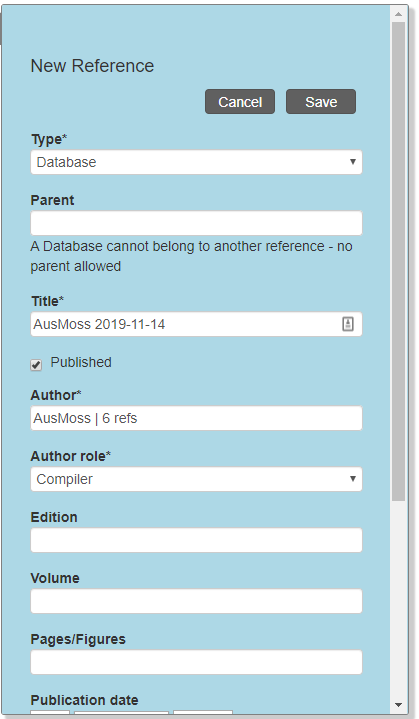

# New Reference

In order to create a new reference, click **New** in the top menu and then **Reference**.

## Journal article

- The reference **Type** for a journal article in the NSL is 'Paper'
- Most journals are already in the system. If one is not, it needs to be added
- To fill in the **Author** field, start typing the surname of the first author and, once the drop-down list is short enough, select the entry you want. You do need to select an author from the drop-down list. If you just type in the string, you won't be able to save the record. If the author is unknown or there is no author (something that shouldn't be the case for a journal article), type '-' and select the '-' entry from the list.
- For **Author role** choose 'Author'.
- There is no separate field for the journal issue, so we add it between parentheses in the **Volume** field. In AusMoss, we only add the issue if the pages in an issue are independently numbered.
- For the **Publication date** we only ever fill in the **year** (last field), so the day and month do not appear in the citation. If you want to add more detailed publication date information, use the **Publication date text** field. Preferrably use ISO Date format – 'yyyy-mm-dd' or 'yyyy-mm', or 'yyyy-mm-dd/yyyy-mm-dd' or 'yyyy-mm/yyyy-mm' for periods in the **Publication date text** field.

## Book

- While the example is a book in a series, I don't know how to add a series as a parent and still get a decent-looking citation, so we database it as if it is not part of a series. APNI does the same for *Flora of Australia* volumes.
- NSL doesn't have fields for **Publisher** and **Place of publication** (yet).

Below is what the reference for the moss volume of *Flora of Australia* looks like (this is the 'Edit' tab, as the record was already created).

## Chapter or section

Below is the entry for Spence & Ramsay's (2006) *Flora of Australia* treatment of Bryaceae as an example of chapter ('Edit' tab of existing record).

## AusMoss reference

I create a new AusMoss reference every day I do edits in AusMoss. I use the 'Database' reference type for that. Because instances in NSL are timestamped, it might already be possible, or require only a small tweak, to have just the one AusMoss reference or, perhaps better, one AusMoss reference per calendar year.

