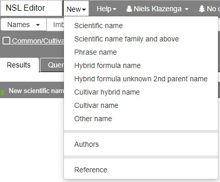

# New Reference

In order to create a new reference, click **New** in the top menu and then **Reference**.

## Journal article

- The reference **Type** for a journal article in the NSL is 'Paper'
- Most journals are already in the system. If one is not, it needs to be added
- To fill in the **Author** field, start typing the surname of the first author and, once the drop-down list is short enough, select the entry you want. You do need to select an author from the drop-down list. If you just type in the string, you won't be able to save the record. If the author is unknown or there is no author (something that shouldn't be the case for a journal article), type '-' and select the '-' entry from the list.
- For **Author role** choose 'Author'.
- There is no separate field for the journal issue, so we add it between parentheses in the **Volume** field. In AusMoss, we only add the issue if the pages in an issue are independently numbered.
- For the **Publication date** we only ever fill in the **year** (last field), so the day and month do not appear in the citation. If you want to add more detailed publication date information, use the **Publication date text** field. Use [ISO 8601](https://en.wikipedia.org/wiki/ISO_8601) datetime format in the **Publication date text** field, so 'yyyy-mm-dd' for complete dates, or 'yyyy-md' if you only know the year and month. For periods, separate the start and end dates with a forward slash ('/').

## Book

- While the example is a book in a series (or multi-volume book rather), I don't know how to add a series as a parent and still get a decent-looking citation, so we database it as if it is not part of a series. APNI does the same for *Flora of Australia* volumes.

In order to add aditional information, save the reference and open the second **Edit** tab.

- You can add the **Publisher** and **Published location** (Place of publication) here.

- Under **Abbreviated title** I fill in the title as I would like to see in the protologue (since yesterday when Anna told me where to find them). For books you use the abbreviations from TL-2 (if it is in there) and for journals the BPH abbreviations. Tropicos has these abbreviations with the names as well, so that will be the easiest place to get them.

  ::: warning Note
  Currently the NSL doesn't do anything with the abbreviated titles that are filled in. That will be a nice enhancement for the future
  :::

- If you want to display a different title in the citation from the one entered in the **Title** field, you can change it in the **Display title** field.

- I filled in the **Language** field, but, since I first saw the field  yesterday, most references in AusMoss will have their language as 'Undetermined'.

- See [Mark a reference as a duplicate](#mark-a-reference-as-a-duplicate) for how to use the **Duplicate of** field.

The third **Edit** tab has various links that can be filled in.

I have filled in the TL-2 number and the BHL link.

::: warning
Do not forget to (individually) save the second and third **Edit** tab. Very easy to forget.
:::

Below is what the reference for the moss volume of *Flora of Australia* looks like (this is the 'Edit' tab, as the record was already created).

...and the second **Edit** tab

## Chapter or section

Below is the entry for Spence & Ramsay's (2006) *Flora of Australia* treatment of Bryaceae as an example of chapter ('Edit' tab of existing record).

## AusMoss reference

I create a new AusMoss reference every day I do edits in AusMoss. I use the 'Database' reference type for that. Because instances in NSL are timestamped, it might already be possible, or require only a small tweak, to have just the one AusMoss reference or, perhaps better, one AusMoss reference per calendar year.

## Mark a reference as a duplicate

You can mark a reference as a duplicate by selecting the reference it is a duplicate of in the **Duplicate of** field in the second **Edit** tab.

When you save the record, the reference will be marked '**[Duplicate]**' in the main pane on the left (I had done it for the references above already; the reference they have all been set as a duplicate of is the reference below).

::: tip
Duplicate references will not show in any drop-downs anymore
:::